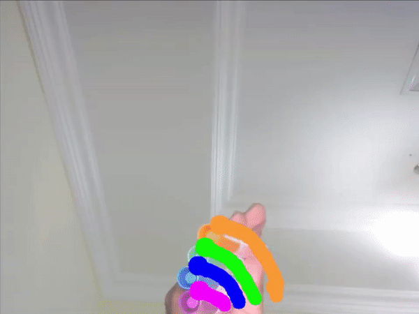

# OPENCV PYTHON GUIDE
 
 

# LEARNING OPEN CV

|Topic|Image|Description|
|:----:|:----:|:----:|
| [Learn OpenCV in 3 Hours]()| |  Learn Opencv in 3 hours using Python.   |

|Virtual Painter|Document Scanner|Number Plate Detector|
|:----:|:----:|:----:|
|||  |
|Contours Detection|Color Detection|Face Detection|
|||  |

# Basic Guideline Opencv

|Topic|Image|Video|
|:----:|:----:|:----:|
| [How to Install OpenCV Win/Mac]()| | Python and Opencv install and testing.    |
| [How to Read Image-Video-Webcam]()| |How to read images videos and webcam.    |
| [5 Must Know OpenCV Basic Functions]()| |5 Must know opencv functions. Gray Scale, Blur, Edge Detection, Dialation and Erosion.    |

# Projects
 

|Topic|Image|
|:----:|:----:|
| [Tic-Tac-Toe](https://github.com/AnuvabSen/Tic-Tac_toe-Open-Cv)|   |
| [Virtual_AI_keyboard](https://github.com/AnuvabSen/Virtual_Key_Board_Using_Opencv)|    |
| [Air-Canvas-Project](https://github.com/AnuvabSen/Air-Canvas-Tensorflow)|   |

# Notes
 

|Index|Comment|
|:---|:---|
|1.|[Recommended IDE: PyCharm Community edition](https://www.jetbrains.com/pycharm/download/)|
